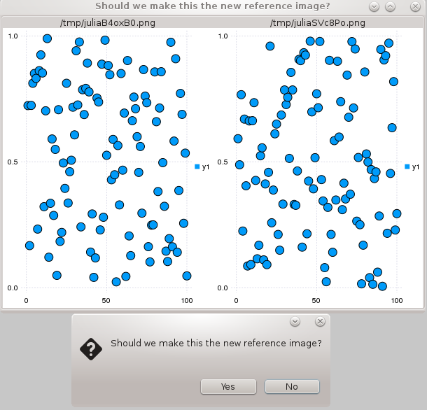

# VisualRegressionTests.jl

Easy regression testing for visual packages. Automated tests compare similarity between a newly generated image
and a reference image using the Images package. While in interactive mode, the tests can optionally pop up a
Gtk GUI window showing a side-by-side comparison of the test and reference image, and then optionally overwrite
the reference image with the test image. This allows for straightforward regression testing of image data, even
when the "correct" images change over time.

#### Author: Thomas Breloff (@tbreloff)

[](https://travis-ci.org/tbreloff/VisualRegressionTests.jl)

## Usage:

Two macros are provided that can be used to perform visual regression. The first macro is for general visual
objects:

```julia
@visualtest testfun refimg popup tol
```

where:

- `testfun` is a function that takes a filename as input, produces a visual, and saves it to disk:

```julia
function testfun(fname)
  visual = produce() # produce some visual object
  save(fname, visual) # save visual to file using filename
end
```

- `refimg` is the filename where to save the reference image for regression testing

- `popup` tells whether or not a Gtk popup window should be shown in case of mismatch (default to true)

- `tol` the tolerance of the comparison (default to 0.02)

The second macro is for plots generated with Plots.jl:

```julia
@plottest plotfun refimg popup tol
```

where the only difference is in the `plotfun` function. In this case, the function should take no argument,
and produce a plot, without saving it. The macro will take care of saving the image as a PNG in the disk.
Alternatively, the `plotfun` argument can be an entire sequence of commands (i.e. a function body):

```julia
@plottest begin
  plot([1.,2.,3.])
  plot!([3.,2.,1.])
  # ...
end "foo.png"
```

## Example GUI popup:



## Bypass GUI popup and replace reference files automatically

Set the environment variable `VISUAL_REGRESSION_TESTS_AUTO` to `true`.
